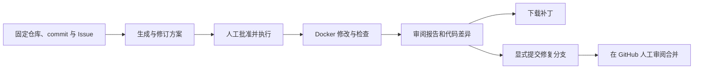

# RepoPilot

<p align="center">
  
</p>

<h3 align="center">🤖 从 GitHub Issue 到可审阅的代码变更</h3>
<p align="center">A self-hosted AI coding workbench for reviewable code changes.</p>

<p align="center">
  <a href="LICENSE"></a>
  <a href="pyproject.toml"></a>
  <a href="pyproject.toml"></a>
  <a href="web/package.json"></a>
  <a href="compose.yaml"></a>
</p>

[快速开始](#快速开始) · [使用文档](docs/README.md) · [开发与贡献](docs/development/contributing.md) · [更新日志](CHANGELOG.md)

---

## 📖 项目简介

RepoPilot 是面向 Python、React 和 Vue 仓库的自托管 AI 编码工作台。它基于固定 commit 和 Issue 生成方案，在人工批准后使用 Docker 执行修改，并集中展示检查结果、代码差异与报告。你可以下载补丁，或单独确认将成果推送为自己仓库的修复分支。

适合希望先审方案、再执行修改，并保留检查记录与人工交付环节的仓库维护者。

## ✨ 功能特性

- **固定来源**：校验 GitHub 仓库、完整 commit SHA 和同仓库 Issue，保存不可变的来源快照与有限源码上下文。
- **先审方案，再执行**：支持方案生成、反馈修订和版本记录；点击“批准并执行”后排队运行。
- **自动准备环境**：识别 Python 和 Node 前端项目，依据项目声明与锁文件准备依赖、语言服务器和已有检查，无需手填安装或检查命令。
- **隔离执行**：单个 Worker 在受限 Docker 容器中运行任务，支持状态轮询、日志查看和取消。
- **可审阅成果**：展示实际命令、退出码、报告及 Diff，支持下载 Patch 和执行记录。
- **显式交付**：审阅后将非空 Patch 提交到自己的 GitHub 仓库修复分支；不自动创建 PR、批准或合并。

## 🧭 工作流程



每次执行都从固定 commit 开始，不继承上一次执行的修改。检查通过表示所选检查命令通过，不能代替人工审查或独立验收。

## 🛠️ 技术栈

| 层级 | 技术与职责 |
| --- | --- |
| 后端 | Python 3.12+、FastAPI、Pydantic、SQLAlchemy |
| 前端 | Vue 3、TypeScript、Vite、Naive UI |
| 数据存储 | PostgreSQL，保存设置、对话、方案与执行记录 |
| 缓存 | Redis，仅用于模型列表缓存 |
| 执行环境 | Docker、顺序 Worker、Python/Node 自动环境与语言服务器 |
| 部署 | Docker Compose、Nginx |

---

<a id="快速开始"></a>
## 🚀 快速开始

需要 **Docker Engine / Docker Desktop 和 Docker Compose**。Worker 会挂载 Docker socket，请在可信宿主机上部署。

### 1. 获取代码与准备配置

首次部署先获取仓库；已有本地副本可跳过克隆：

```bash
git clone https://github.com/ox0pine/RepoPilot.git
cd RepoPilot
```

在仓库根目录执行，保留已有 `.env`：

```bash
test -f .env || cp .env.example .env
```

编辑 `.env`：

- 将 `POSTGRES_PASSWORD` 替换为自己的数据库密码。
- 将 `API_TOKEN` 替换为随机长字符串，用于工作台登录。
- 按[配置指南](docs/configuration/environment.md)生成并保存 `GITHUB_CREDENTIALS_KEY`，用于加密 GitHub 凭据；独立备份，后续不要随意更换。

### 2. 启动服务

```bash
docker compose up -d --build --wait
docker compose ps -a
```

访问 **http://127.0.0.1:8081/**，使用 `API_TOKEN` 登录。此命令同时构建执行镜像并启动 Worker；`runtime` 服务成功退出是正常状态。

### 3. 创建第一个任务

1. 在设置中配置模型端点、API Key（如需要）和模型，再保存 GitHub token。权限要求见[外部服务设置](docs/configuration/integrations.md)。
2. 填写 GitHub HTTPS 仓库地址、完整 40 位 commit SHA 和同仓库 Issue 链接。
3. 审阅生成的方案，必要时提交反馈，然后点击“批准并执行”。
4. 查看执行结果与代码变更，下载补丁，或单独点击“提交修复分支”。

完整说明见[部署指南](docs/operations/deployment.md)和[使用指南](docs/guide/workflow.md)。

## 📚 使用文档

| 你想了解 | 阅读 |
| --- | --- |
| 环境变量、端口和加密密钥 | [配置参考](docs/configuration/environment.md) |
| 模型连接、GitHub 权限与 SSH | [外部服务设置](docs/configuration/integrations.md) |
| 方案修订、执行、取消和分支交付 | [使用工作台](docs/guide/workflow.md) |
| 服务维护、数据保护与故障排查 | [运维指南](docs/operations/maintenance.md) |
| 本地开发、验证命令与代码结构 | [开发指南](docs/development/contributing.md) · [架构说明](docs/development/architecture.md) |
| 容器隔离、资源限制和 API | [安全边界](docs/reference/security.md) · [API 概览](docs/reference/api.md) |

## 📁 项目结构

```text
RepoPilot/
├── src/repopilot/
│   ├── api/           # HTTP 接口与应用装配
│   ├── application/   # 设置、方案与执行用例
│   ├── domain/        # 数据契约与状态约束
│   ├── persistence/   # PostgreSQL 持久化
│   ├── integration/   # GitHub、模型与缓存集成
│   ├── execution/     # Docker 执行、工具与语言服务器
│   └── worker.py      # 顺序执行 Worker
├── web/               # Vue 前端
├── tests/             # 后端测试
├── deploy/            # 容器镜像与 Nginx 配置
├── docs/              # 使用、配置、开发与运维文档
├── compose.yaml       # 完整服务编排
└── .env.example       # 环境变量示例
```

## 🔒 安全与使用边界

- 当前支持 Python 和 Node 前端项目，不支持其他语言执行器、执行中反馈、继承前次修改或 SSE。
- 依赖准备可能联网下载和执行第三方安装脚本；模型工具执行阶段断网。沙箱不等于对任意恶意代码的绝对安全保证。
- 所有持有访问密钥的成员共享工作台数据与凭据，不提供多租户隔离。
- GitHub token 和私钥加密保存；模型 API Key 当前以明文存储在数据库中，需要保护数据库与备份。
- 日常停止使用 `docker compose down` 保留数据卷，**不要使用 `down -v`，除非明确要删除数据**。

## 🤝 参与贡献

欢迎提交可复现的问题、文档改进和代码变更。开始前请阅读[本地开发与贡献](docs/development/contributing.md)，提交时说明影响范围与实际验证结果，勿包含凭据或真实用户数据。

## 📄 许可证

本项目采用 [PolyForm Noncommercial License 1.0.0](LICENSE)，允许许可证定义的非商业用途；商业使用需另行取得权利人授权。该许可证不是 OSI 批准的开源许可证，本项目属于源码可用项目。具体授权范围及条件以许可证全文为准。
